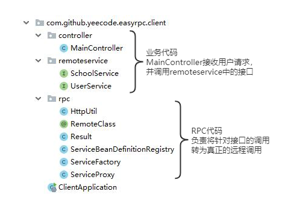
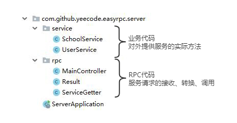

# [EasyRPC](https://github.com/yeecode/EasyRPC)


---

EasyRPC是一个远程过程调用（Remote Procedure Call，简称RPC）的最小实现。它使用极少的类、方法演示了RPC的实现原理，是一个学习RPC工作原理的良好示例。

该项目十分简单，包括客户端EasyRpcClient和服务端EasyRpcServer两部分。演示时，EasyRpcClient会通过RPC调用EasyRpcServer中的方法。

# 功能演示

从`/client/target/`文件夹下下载最新版的`EasyRpcClient-x.x.x.jar`文件，并使用下面的命令启动：

```
java -jar EasyRpcClient-x.x.x.jar
```
则EasyRpcClient启动，并工作在`12310`端口。

从`/server/target/`文件夹下下载最新版的`EasyRpcServer-x.x.x.jar`文件，并使用下面的命令启动：

```
java -jar EasyRpcServer-x.x.x.jar
```

则EasyRpcServer启动，并工作在`12311`端口。

然后可以调用以下几个方法：

- `127.0.0.1:12310/getUserCount`
- `127.0.0.1:12310/getUserInfo`
- `127.0.0.1:12310/addUser`
- `127.0.0.1:12310/querySchoolName`

上面几个方法会被则EasyRpcClient接收。然后，EasyRpcClient会通过RPC调用EasyRpcServer获得操作结果，并返回。

# 功能实现

## EasyRpcClient实现

业务代码类为`MainController`、`SchoolService`、`UserService`三个类。其中`MainController`类负责接收外部请求并调用`SchoolService`、`UserService`。`SchoolService`、`UserService`是两个接口，并不包含实现，其具体实现由EasyRpcServer提供。

RPC代码类在`rpc`子包中，主要完成动态代理、远程调用参数序列化、远程调用发起、远程调用结果反序列化等工作。



## EasyRpcServer实现

业务带代码类为`SchoolService`、`UserService`两个类，类中包含具体实现。EasyRpcClient通过RPC最终调用了这里的代码。

RPC代码类在`rpc`子包中，主要完成远程调用接收、调用参数反序列化、调用实际触发、调用结果序列化等工作。


